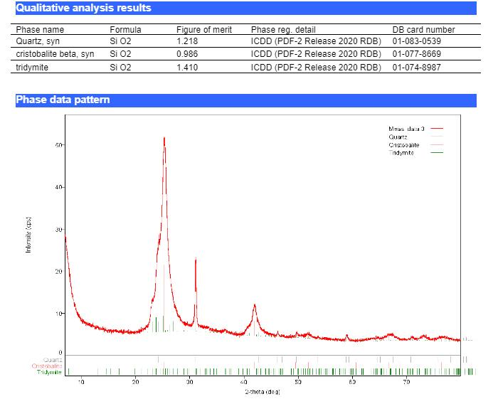

# Hello

## ქართულ ენაზე იხილეთ ქვემოთ

русский язык ниже

Most likely, you are holding in your hands one of the specimens of a petrified tree from the Goderdzi Pass, Adjara, Sakartvelo.
This tree turned to stone about 5-7 million years ago, as a result of powerful volcanic activity of the Tertiary period, which hid the existing tropical forest under lava and ash. Organics went through a path of replacement and crystallization of rocks. It turned into quartz, opals, chalcedones, agates, etc.

The first known expeditions in 1908-1910 were made after the discovery of fossils by Alexander Florensky (father of philosopher and theologian Pavel Florensky) during the construction of the Batumi-Akhaltsikhe highway (Arsian Ridge). Fossils of plants from the late Pliocene forest were found. 

They were palms, magnolia, laurel, birch, hornbeam, beech - all preserved as imprints of semi-fossilized leaves and stems in volcanic tuff.
That followed a series of expeditions that allowed to describe and study the condition   of petrified forest formation in the region. All links to articles, publications and scientific reports can be found below (1).

We also enclose our own materials of searching and finding stones and the results of gemological examination (2023G). For a more detailed study, we have taken some popular specimens to determine their approximate composition.(2)
You can explore the route yourself using our geo-tags (3)
At the moment, fragments of petrified forest can be found on the Batumi-Akhaltsikhe highway, Meskheti region; when you come to the "Natural Monument Goderdzi Petrified Forest" (4) or to the village of Kabardino-Badakhshan (4), you can visit the "Nature Monument Goderdzi Petrified Forest" (3).(4) or by visiting the Batumi Archaeological Museum (Sakartvelo)(5). Some specimens can be found in archaeological museums in the territories of Armenia and Russia.

## footnotes:

1.
[Goderdzi Petrified Forest Natural Monument](m.wikipedia.org/wiki/Goderdzi_Petrified_Forest_Natural_Monument)

https://apa.gov.ge/en/protected-areas/Naturalmonument/goderdzis-namarxi-tyis-bunebis-dzegli /

2.

3.

41.643991, 42.491336 Batumi-Akhaltsikhe,Georgia

41.630692, 42.491483 Batumi-Akhaltsikhe,Georgia

41.627324, 42.530111 Goderdzi Pass-Beshumi,Georgia

41.638980, 42.582749 Batumi-Akhaltsikhe,Georgia

4.
[The nature monument "Petrified forest of Goderdzi"](http://apa.gov.ge/en/protected-areas/Naturalmonument/goderdzis-namarxi-tyis-bunebis-dzegli/)

5.
[Batumi Archaeological Museum](https://ajaramuseums.ge/ru/museums/arch)

# გამარჯობა!

თქვენ გიჭირავთ ხელში გაქვავებული ხის ერთ-ერთი ეგზემპლარი გოდერძის უღელტეხილიდან,აჭარა, საქართველო!
ეს ხე გარდაიქმნა ქვად 5-7 მილიონი წლის წინ, მძლავრი ვულკანური აქტიურობის შედეგად, მესამეული სისტემის პერიოდის დროს, რამაც დამარხა იმ დროს არსებული ტროპიკული ტყე
ლავის და ფერფლის ქვეშ. ორგანიკამ გაიარა ნიადაგის შერევის და კრისტალიზაციის პროცესი,გარდაიქმნა კვარცად,აგატებად, ქალცედონებად და ოპალებად.

   პირველი ცნობილი ექსპედიციები 1908-1910 წლებში იყო, ალექსანდრე ფლორენსკის მიერ გაქვავებული ხის ფრაგმენტების პოვნის შემდეგ (ფილოსოფოსის პავლე ფლორენსკის მამის) 
ბათუმი-ახალციხის გზის მშენებლობის დროს.იქნა ნაპოვნი გაქვავებული, გვიანი პლეოცენის პერიოდის ტყის მცენარეები - პალმა, მაგნოლია,ბზა,ალვის ხე, წიფელა. ნაკვალევის სახით იქნა შენახული 
ნახევრად გაქვავებული ფოთლები და ტოტები ვულკანურ ტუფში.

 შემდეგში ამ მოვლენებს მოჰყვა მთელი რიგი ექსპედიციები, რომელთა დახმარებითაც იქნა შესაძლებელი დეტალურად აღწერილიყო
რეგიონში გაქვავებული ტყის ფორმირება. ყველა ბმულს სტატიების,პუბლიკაციების და სამეცნიერო მოკვლევის შესახებ იპოვით ქვემოთ (1)
ასევე ჩვენ დაურთავთ,ქვების ძებნის და მოპოვების პროცესის საკუთარ მატერიალებს,ასევე გეოლოგიური ექსპერტიზის რეზულტატებს(2023). უფრო
დეტალური შესწავლისთვის, ჩვენ ავიღეთ რამოდენიმე პოპულარული ეგზემპლარები,რომ განგვესაზღვრა მათი შემადგენლობა (2)
თქვენ შეგიძლით თვითნებურად შეისწავლოთ მარშუტი,ჩვენი გეო-თეგების გამოყენებით(3)
მოცემულ მომენტში, გაქვავებული ტყის ფრაგმენტების ნახვა შესაძლებელია ბათუმი-ახალციხის დამაკავშირებელ გზაზე,მესხეთის რაიონში, როცა აღმოჩნდებით გოდერძის ნამარხი ტყის ბუნების ძეგლთან(4) ან
ან შეგიძლიათ ესტუმროთ ბათუმის არქეოლოგიურ მუზეუმს(5). ზოგი ეგზემპლარის ნახვა შეიძლება ასევე არქეოლოგიურ მუზეუმებში სომხეთის და რუსეთის ტერიტორიაზე.

## ბმულები:

1 
https://ru.m.wikipedia.org/wiki/Годердзи (უღელტეხილი)
https://apa.gov.ge/en/protected-areas/Naturalmonument/goderdzis-namarxi-tyis-bunebis-dzegli /

2

3

41.643991, 42.491336 Batumi-Akhaltsikhe,Georgia

41.630692, 42.491483 Batumi-Akhaltsikhe,Georgia

41.627324, 42.530111 Goderdzi Pass-Beshumi,Georgia

41.638980, 42.582749 Batumi-Akhaltsikhe,Georgia

4.

ბუნების ძეგლი "გოდერძის გაქვავებული ტყე"
[The nature monument "Petrified forest of Goderdzi"](http://apa.gov.ge/en/protected-areas/Naturalmonument/goderdzis-namarxi-tyis-bunebis-dzegli/)

5.

ბათუმის არქეოლოგიური მუზეუმი
[Batumi Archaeological Museum](https://ajaramuseums.ge/ru/museums/arch)

## Привет

Скорее всего, вы сейчас держите в руках один из экземпляров окаменелого дерева с перевала Годердзи, Аджария, Сакартвело. 
Это дерево превратилось в камень около 5-7 млн лет назад, в результате мощной вулканической активности третичного периода, что скрыла существовавший тропический лес под лавой и пеплом. Органика прошла путь замещения и кристаллизации пород, превращаясь в кварц, опалы, халцедоны, агаты и др.

Первые известные экспедиции в 1908-1910гг были сделаны после находок окаменелостей Александром Флоренским (отцом философа и богослова Павла Флоренского) при строительстве трассы Батуми-Ахалцихе (Арсиянский хребет). Были найдены окаменелости растений из леса позднего плиоцена — пальмы, магнолия, лавр, береза, граб, бук - сохранились в виде отпечатков полу-окаменелых листьев и стеблей в вулканическом туфе.

Далее последовали серии экспедиций позволившие подробнее описать и изучить условия формирования окаменелого леса в регионе.
Все ссылки на статьи, публикации и научные отчеты вы найдете ниже (1).

Также мы прилагаем собственные материалы поиска и нахождения камней а также, результаты геммологической экспертизы (2023Г). Для более подробного изучения, мы взяли несколько популярных экземпляров, чтобы определить их примерный состав.(2)

Вы можете самостоятельно изучить маршрут используя наши гео-теги (3)

В данный момент, фрагменты окаменелого леса можно встретить на трассе Батуми-Ахалцихе, область Месхети; приехав в "Природный памятник окаменелый лес Годердзи" (4) или посетив Батумский археологический музей (Сакартвело)(5). Некоторые экземпляры можно найти в археологических музеях на территориях Армении и России.

## сноски:

1.

New Data on Formation of Goderdzi Petrified Wood
(Georgia)Nodar Poporadze*, Badri Gogia*, Niko Poporadze* http://science.org.ge/bnas/t13-n4/11_Poporadze.pdf

https://ru.m.wikipedia.org/wiki/Годердзи_(перевал)

https://en.m.wikipedia.org/wiki/Goderdzi_Petrified_Forest_Natural_Monument

Goderdzi Petrified Forest Natural Monument
https://apa.gov.ge/en/protected-areas/Naturalmonument/goderdzis-namarxi-tyis-bunebis-dzegli/

2.

 

3.

41.643991, 42.491336
Batumi-Akhaltsikhe,Грузия

41.630692, 42.491483
Batumi-Akhaltsikhe,Грузия

41.627324, 42.530111
Goderdzi Pass-Beshumi,Грузия

41.638980, 42.582749
Batumi-Akhaltsikhe,Грузия

4.

Памятник природы "Окаменелый лес Годердзи"
http://apa.gov.ge/en/protected-areas/Naturalmonument/goderdzis-namarxi-tyis-bunebis-dzegli/

5.

Батумский археологический музей
https://ajaramuseums.ge/ru/museum

